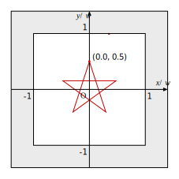

# ggsample15

[ゲームグラフィックス特論](https://tokoik.github.io/gg/)の補助プログラム
([gg.h](gg.h), [gg.cpp](gg.cpp), および [Window.h](Window.h)) を使った、
OpenGL プログラミングのガイドです。

## はじめに

### ゲームグラフィックス特論の補助プログラム

ゲームグラフィックス特論では、宿題にグラフィックス API (Application Program Interface) の一つである [OpenGL](https://www.opengl.org/) を使った、グラフィックスプログラミングを課しています。この宿題プログラムでは Linux (gcc 9.3.0)、Windows (Visual Studio 2019)、macOS (Xcode 12) に対応するために、クロスプラットフォームのフレームワークである [GLFW](https://www.glfw.org/) を使用しています。GLFW は各プラットフォームにおけるウィンドウの作成や操作、キーボード・マウス等とのインタフェースなどを提供し、OpenGL の API が使用できるようにお膳立てをしてくれます。しかし、これだけでグラフィックスプログラミングをするのは、まだちょっと手間がかかります。

もっと手軽にグラフィックスプログラミングをするには、[openFrameworks](https://openframeworks.cc/ja/) のようなフレームワークや、[Unity](https://unity.com/ja)、[Unreal Engine](https://www.unrealengine.com/ja/) などのミドルウェアが使えます。しかし、これらは OpenGL（の他、 [Vulkan](https://www.vulkan.org/)、[DirectX](https://docs.microsoft.com/ja-jp/windows/win32/directx)、[METAL](https://developer.apple.com/jp/metal/) などの低レベル API）自体を隠して使うようになっています。そのため、OpenGL 自体の勉強が目的である、あるいは、それを使って研究するという用途では、これらもちょっと使いにくいように思います。

じゃあ、いっそのこと OpenGL を使うのをやめて、最初から Unity などを使えばいいんじゃないかということになります。実際、その通りだと思います。でも、例えば Unity を使って研究レベルのちょっと込み入ったことをしようと思うと、結局 Unity の中身（データ構造など）について結構詳しく知る必要があって、それはそれで初心者にはちょっと厳しいものがあります。Unity は初心者でも簡単に使えるように作られていますが、その内部は最新の高度な技術の集大成になっています。だから初心者に開かれている部分より先に進もうとすると、すぐに手も足も出なくなってしまいます。実際、Unity でゲームを作った経験があるのに、プログラムが書けないという人がいました。

そこで、既に作りこまれた複雑なデータ構造や、それを取り扱うライブラリ関数の操作方法を知ることなく OpenGL の API や生のデータを直接操作するようなプログラムを書くために、ここでは OpenGL の API を直接使ってグラフィックスプログラミングを行うことにします。そのために、非常に小さな**補助プログラム**を用意しました。

* [ゲームグラフィックス特論の補助プログラムのマニュアル](https://tokoik.github.io/gg/html/)

### CPU と GPU

コンピュータのの主要な構成要素（部品とか）に **CPU**（Central Processing Unit, 中央演算処理装置）と**メインメモリ** (Main Memory, 主記憶装置) があります。また、最近のパソコンやスマートフォンを代表とする身の回りにあるコンピュータらしいコンピュータには、たいてい**ディスプレイ**（画面）が付いています。このディスプレイに表示する映像は、図の破線部分のグラフィックスハードウェアによって生成されています。この部分は**ビデオカード**等の CPU の外部にある拡張ハードウェアの場合もありますが、最近の多くの CPU には内蔵されています。

グラフィックスハードウェアの中で図形を描画したり映像を生成したりする中心的な部品は **GPU** (Graphics Processing Unit, グラフィックス演算処理装置) と呼ばれます。CPU 同様、これにも**メモリ**が接続されています。このメモリはグラフィックスハードウェア上に専用のものが用意されている場合もありますが、グラフィックスハードウェアが CPU に内蔵されている場合は、メインメモリと共用していることもあります。


CPU はメインメモリに格納されているプログラムを取り出し、その命令に従って、やはりメインメモリに格納されているデータを取り出し、それを使って計算した結果をメインメモリに格納します。CPU とメインメモリを結んでいる線は**メモリバス**と呼ばれます。


GPU も CPU と同様に、それに接続されているメモリに格納されているプログラム (Program Object) を取り出し、その命令に従って、メモリに格納されている**頂点属性** (Vertex Attribute, 頂点ごとの位置や法線などのデータ) を取り出して、それをもとに図形を描画します。この描画した結果は**画素データ** (Fragment Data) として、メモリに格納されます。GPU は格納した画素データを周期的に読み出し、それをもとに映像信号を生成して、ディスプレイに図形を表示します。


### GPU のプログラミング

CPU のプログラムは、CPU 自身が**オペレーティングシステム** (OS, Linux / macOS / Windows など) の指示に基づいてメモリに読み込んで、その実行を開始します。これに対して GPU のプログラムは、CPU で動作しているプログラムから渡されたものをグラフィックスハードウェアのメモリに読み込んで、CPU の指示によって実行を開始します。つまり GPU は、CPU とは独立して**並行動作**しますが、CPU の指示に従って補助的に機能します。CPU と GPU を結んでいる線は **I/O バス** (Input / Output Bus) と呼ばれます。

## プログラムの解説

### ウィンドウを開く

ディスプレイに表示する内容は GPU によって作成されますが、ディスプレイ上のウィンドウの生成、すなわち GPU が図形を描く領域の確保は、CPU が GPU に指示することによって行われます。ゲームグラフィックス特論の補助プログラムでは、これは `Window` クラスのインスタンスを生成することによって行います。以下は [ggsample15.cpp](ggsample15.cpp) の最初の部分です。この初期化並びの最初の値 `"ggsample15"` は、開くウィンドウのタイトルバーに表示する文字列です。

```cpp
//
// ゲームグラフィックス特論宿題アプリケーション
//
#include "GgApp.h"

//
// アプリケーション本体
//
int GgApp::main(int argc, const char* const* argv)
{
  // ウィンドウを作成する
  Window window{ "ggsample15" };
```

* [Window クラス](https://tokoik.github.io/gg/html/classWindow.html)

### シェーダを準備する

GPU が実行するプログラムのことを**シェーダ**と言います。OpenGL のシェーダは、[OpenGL Shading Language (GLSL)](https://www.khronos.org/opengl/wiki/OpenGL_Shading_Language) という**プログラミング言語**で記述します。このソースプログラムを CPU 側で文字列として用意して、OpenGL の API を使ってコンパイルとリンクを実行します。そうして出来上がった GPU で実行可能なプログラム (Program Object) は GPU に送られます。

この一連の処理は CPU 側のプログラムで実行します。この手続きは少しばかり面倒なので、ゲームグラフィックス特論の補助プログラムでは、シェーダのソースプログラムを書き込んだテキストファイルを読み込んで Program Object を生成する `ggloadShader()` という関数を用意しています。[simple.vert](simple.vert) と [simple.frag](simple.frag) は、シェーダのソースプログラムを格納したテキストファイルです。

```cpp
  // シェーダのプログラムオブジェクトを作成する
  const GLuint shader{ ggLoadShader("simple.vert", "simple.frag") };
```

* [補助プログラムの名前空間 (gg)](https://tokoik.github.io/gg/html/namespacegg.html)


#### バーテックスシェーダ

`simple.vert` は**頂点ごと**に実行され、その頂点属性をもとに座標変換などを行う**バーテックスシェーダ** (Vertex Shader) のソースプログラムです。この内容は、現時点では次のようにしています。

```glsl
#version 410

layout (location = 0) in vec4 position;

void main()
{
  gl_Position = position;
}
```

この 1 行目の `#version 410` は、使用する GLSL のバージョンを表します。`410` は OpenGL バージョン 4.1 とともに策定された GLSL バージョン 4.1 を表します。この行は GLSL のソースプログラムの 1 行目に置く必要があります。

`in vec4 position` は `vec4` 型の変数 `position` を、このシェーダの入力変数 (`in`) に使うという宣言です。`vec4` は 4 つの `float` 型の実数からなるベクトルのデータ型です。OpenGL では 3 次元の座標値 (x, y, z) を 4 次の同時座標 (x / w, y / w, z / w, w) で表します。

バーテックスシェーダの入力は頂点属性 (Vertex Attribute) ですので、バーテックスシェーダの入力変数は、特に **attribute 変数**と呼ばれます。`layout (location = 0)` は、この attribute 変数がインデックスが 0 の頂点バッファオブジェクトからデータを取り出すことを示す修飾子 (qualifier) です。頂点バッファオブジェクトのイデックスについては後述します。

`main()` は C 言語などと同様、このプログラムのエントリポイント（実行開始点）の関数名です。ただしシェーダは値を返しませんので、この戻り値のデータ型は `void` になります。`gl_Position` は GLSL の組み込み変数で、これに代入した値が次のステージに送られます。このプログラムでは、頂点バッファオブジェクトから取り出した座標値を、そのまま `gl_Position` に代入しています。

なお、`gl_Position` に設定した 4 次の同時座標 (x, y, z, w) は、3 次元空間上の (x / w, y / w, z / w) の位置に投影されます。このとき、-1 &leq; x / w &leq; 1、-1 &leq; y / w &leq; 1、-1 &leq; z / w &leq; 1 の範囲からはみ出た図形の部分は刈り取られます。この処理は**クリッピング処理**と言います。また `gl_Position` の座標系は**クリッピング座標系**と呼びます。


#### ラスタ化処理

バーテックスシェーダの次のステージは**ラスタ化処理**（ラスタライザ）です。ラスタ化処理は頂点属性で表された図形データから、それを画面に表示するための画像データを作成します。


#### フラグメントシェーダ

ラスタ化処理によって図形が塗りつぶされて、画像が作成されます。`simple.frag` は図形を塗りつぶす際に**画素ごと**に実行され、画素データを生成する**フラグメントシェーダ** (Fragment Shader) のソースプログラムです。この内容は、現時点では次のようにしています。

`out vec4 color` は `vec4` 型の変数 `color` を、このシェーダの出力変数 (`out`) に使うという宣言です。`layout (location = 0)` は、この変数に代入した値をフレームバッファの 0 番のアタッチメントに格納することを示す修飾子です。0 番のアタッチメントは、デフォルトでは画面に表示されるカラーバッファになっています。

`vec4(1.0, 0.0, 0.0, 1.0)` は 1.0, 0.0, 0.0, 1.0 の 4 つの実数値を `vec4` 型の一つのベクトルに型変換する**キャスト**です。それぞれの値は、この場合は左から順に赤 (Red)、緑 (Green)、青 (Blue) の強さ、および不透明度 (Alpha) を 0～1 の値で指定します。この場合は赤と不透明度が 1 なので、図形は赤色で描画されます。 

```glsl
#version 410

layout (location = 0) out vec4 color;

void main()
{
  color = vec4(1.0, 0.0, 0.0, 1.0);
}
```

#### レンダリングパイプライン

これまでに述べたように、図形の描画は「バーテックスシェーダによる頂点ごとの処理→ラスタ化処理による画像化→フラグメントシェーダによる画素ごとの処理」という流れで実行されます。この流れの構造を**レンダリングパイプライン**と呼びます。


### 頂点配列オブジェクトを作成する

頂点属性 (Vertex Attribute) は、図形の一つ一つの頂点に設定されるデータです。一つの頂点には、位置や色、法線ベクトル、テクスチャ座標など、必要に応じて様々なものが設定されます。また、一つの図形は複数の頂点属性の組み合わせで表現されるので、**頂点配列オブジェクト** (Vartex Array Object, **VAO**) を作成して、それにこれらを登録します。図形の描画などの処理は、この VAO を**結合** (bind, 処理の対象に指定) してから行います。

```cpp
  // 頂点配列オブジェクトを作成する
  GLuint vao;
  glGenVertexArrays(1, &vao);

  // 頂点配列オブジェクトを結合する
  glBindVertexArray(vao);
```

* [glGenVertexArrays()](https://www.khronos.org/registry/OpenGL-Refpages/gl4/html/glGenVertexArrays.xhtml)
* [glBindVertexArray()](https://www.khronos.org/registry/OpenGL-Refpages/gl4/html/glBindVertexArray.xhtml)

### 頂点バッファオブジェクトを作成する

GPU が描画する図形の頂点ごとのデータ（位置、色、法線など）を**頂点属性** (Vertex Attribute) と言います。GPU で図形を描画するには、先にこの頂点属性をグラフィックスハードウェアのメモリに転送します。そのため、このメモリ上に頂点属性のデータを確保する領域を、あらかじめ確保しておく必要があります。この領域のことを**頂点バッファオブジェクト** (Vertex Buffer Object, **VBO**) と言います。この VBO を作成して結合します。VAO を結合している状態で VBO を結合すれば、その VAO に VBO が組み込まれます。

```cpp
  // 頂点バッファオブジェクトを作成する
  GLuint vbo;
  glGenBuffers(1, &vbo);

  // 作成した頂点バッファオブジェクトを結合する
  glBindBuffer(GL_ARRAY_BUFFER, vbo);
```

* [glGenBuffers()](https://www.khronos.org/registry/OpenGL-Refpages/gl4/html/glGenBuffers.xhtml)
* [glBindBuffer()](https://www.khronos.org/registry/OpenGL-Refpages/gl4/html/glBindBuffer.xhtml)

この VBO のメモリを確保して、そこに頂点属性のデータを転送します。この頂点属性は、2 次元平面上の 4 点の座標値です。なお、これはシェーダにおいて z = 0、w = 1 の同次座標として扱われます。

```cpp
  // 座標データ
  static const GLfloat position[][2]{
    { -0.5f, -0.5f },
    {  0.5f, -0.5f },
    {  0.5f,  0.5f },
    { -0.5f,  0.5f }
  };

  // 頂点バッファオブジェクトのメモリを確保してデータを座標データを転送する
  glBufferData(GL_ARRAY_BUFFER, sizeof position, position, GL_STATIC_DRAW);
```

* [glBufferData()](https://www.khronos.org/registry/OpenGL-Refpages/gl4/html/glBufferData.xhtml)


### 頂点バッファオブジェクトにインデックスを設定する

また、この頂点バッファオブジェクトにインデックス（番号）を付けておきます。このインデックスはシェーダの実行を開始した GPU が入力データの頂点属性を取り出す先として用います。

```cpp
  // この頂点バッファオブジェクトの先頭に 0 番のインデックスを割り当てる
  glVertexAttribPointer(0, 2, GL_FLOAT, GL_FALSE, 0, 0);

  // 0 番のインデックスを有効にする
  glEnableVertexAttribArray(0);
```

* [glVertexAttribPointer()](https://www.khronos.org/registry/OpenGL-Refpages/gl4/html/glVertexAttribPointer.xhtml)
* [glEnableVertexAttribArray()](https://www.khronos.org/registry/OpenGL-Refpages/gl4/html/glEnableVertexAttribArray.xhtml)

### 頂点バッファオブジェクトの結合を解除する

頂点バッファオブジェクトの設定が終わったら、結合を解除します。

```cpp
  // 頂点バッファオブジェクトの結合を解除する
  glBindBuffer(GL_ARRAY_BUFFER, 0);
```

### 頂点配列オブジェクトの結合を解除する

全ての頂点バッファオブジェクトの設定が終わって図形の定義が完了したら、頂点配列オブジェクトの結合を解除します。

```cpp
  // 頂点配列オブジェクトの結合を解除する
  glBindVertexArray(0);
```

### 図形を描画する

以上でシェーダと頂点配列オブジェクト（図形データ）の準備ができました。ディスプレイに図形を表示し続けるするには、これらを指定して繰り返し図形を描画します。`Window` クラスのインスタンス `window` は、描画するウィンドウが閉じられない間、`true` を返します。

```cpp
  // 背景色を指定する
  glClearColor(1.0f, 1.0f, 1.0f, 0.0f);

  // ウィンドウが開いている間繰り返す
  while (window)
  {
    // ウィンドウ内の表示を消去する
    glClear(GL_COLOR_BUFFER_BIT);
```

* [glClearColor()](https://www.khronos.org/registry/OpenGL-Refpages/gl4/html/glClearColor.xhtml)
* [glClear()](https://www.khronos.org/registry/OpenGL-Refpages/gl4/html/glClear.xhtml)

描画に使用するシェーダを指定します。

```cpp
    // 描画に使用するシェーダを指定する
    glUseProgram(shader);
```

* [glUseProgram()](https://www.khronos.org/registry/OpenGL-Refpages/gl4/html/glUseProgram.xhtml)

描画する頂点配列オブジェクトを指定します。

```cpp
    // 描画する頂点配列オブジェクトを指定する
    glBindVertexArray(vao);
```

描画を実行します。この処理はドローコール (Draw Call) と呼ばれます。ドローコールの処理は GPU 側で実行されます。

```cpp
    // 図形を描画する
    glDrawArrays(GL_LINE_STRIP, 0, 4);
```

* [glDrawArrays()](https://www.khronos.org/registry/OpenGL-Refpages/gl4/html/glDrawArrays.xhtml)


頂点配列オブジェクトとシェーダの指定を解除します。

```cpp
    // 頂点配列オブジェクトの指定を解除する
    glBindVertexArray(0);

    // シェーダの指定を解除する
    glUseProgram(0);
```

カラーバッファを入れ替えます。
この時にキーボードやマウスの操作などが行われたかどうか（イベントの発生の有無）を調べています。

```cpp
    // カラーバッファを入れ替えてイベントを取り出す
    window.swapBuffers();
  }
```

ウィンドウが閉じられたら (`window` が `false`) 戻ります。
このプログラムでは、これでプログラムが終了します。

```cpp
  return 0;
}
```

## 演習

1. 下の図形を描いてください。

   

2. この図形は `GL_LINE_STRIP` という基本図形を用いて描いています。基本図形には、他にも次のようなものがあります。このうちの `GL_TRIANGLE_STRIP` を使って、その下に示す塗りつぶした矩形を描いてください。

   
   

3. 基本図形に `GL_TRIANGLE_FAN` を使って、2. と同じ矩形を描いてください。