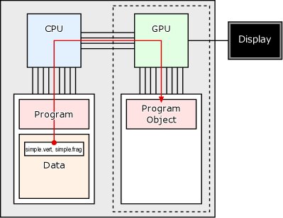

# ggsample15

ゲームグラフィックス特論の補助プログラム
([gg.h](gg.h), [gg.cpp](gg.cpp), および [Window.h](Window.h)) を使った、
OpenGL プログラミングのガイドです。

[ゲームグラフィックス特論](https://tokoik.github.io/gg/) では、宿題に [OpenGL](https://www.opengl.org/) を使ったグラフィックスプログラミングを課しています。この宿題プログラムでは、Linux (gcc 9.3.0)、Windows (Visual Studio 2019)、macOS (Xcode 12) に対応するために、クロスプラットフォームのフレームワークである [GLFW](https://www.glfw.org/) を使用しています。GLFW は各プラットフォームのキーボードやマウス、ウィンドウ等とのインタフェースを提供し、OpenGL の API が使用できるようにお膳立てをしてくれます。しかし、これだけで OpenGL によるグラフィックスプログラミングをするのは、まだちょっと手間がかかります。

そのために [openFrameworks](https://openframeworks.cc/ja/) のようなフレームワーク、あるいは [Unity](https://unity.com/ja)、[Unreal Engine](https://www.unrealengine.com/ja/) といったミドルウェアが作られています。しかし、これらは OpenGL 自体を隠して使うようになっています。そのため、OpenGL 自体を勉強する、あるいはそれを使って研究するという目的では、これらもちょっと使いにくいように思います。

じゃあ OpenGL を使うのをやめて、最初から Unity とか使えばいいんじゃないかという話になりますが、実際そうです。でも、例えば Unity を使って研究レベルのちょっと込み入ったことをしようと思うと、結局 Unity の中身（データ構造など）について結構詳しく知る必要があって、それはそれで初心者にはちょっと難しいものがあります。Unity は初心者でも簡単に使えるように作られていますが、その内部は最新の高度な技術の集大成です。だから初心者に開かれている部分より先に進もうとすると、すぐに手も足も出なくなってしまいます。

そこで、生のデータを直接操作するようなプログラムを、既に作りこまれた複雑なデータ構造や、その操作方法を知ることなく書くために、ここでは OpenGL の低いレベルの機能を直接使ってグラフィックスプログラミングを行うことにします。

## CPU と GPU

コンピュータのの主要な構成要素（部品とか）に **CPU**（Central Processing Unit, 中央演算処理装置）と**メインメモリ** (Main Memory, 主記憶装置) があります。また、最近のパソコンやスマートフォンを代表とする身の回りにあるコンピュータらしいコンピュータには、たいてい**ディスプレイ**（画面）が付いています。このディスプレイに表示する映像は、破線部分のグラフィックスハードウェアによって生成されています。この部分はビデオカード等の拡張ハードウェアとなっている場合もありますが、最近の多くの CPU には内蔵されています。

グラフィックスハードウェアの中で図形を描画したり映像を生成したりする中心的な部品は **GPU** (Graphics Processing, Unit, グラフィックス演算処理装置) と呼ばれます。CPU 同様、これにも**メモリ**が接続されています。このメモリはグラフィックスハードウェア上に専用のものが用意されている場合もありますが、グラフィックスハードウェアが CPU に内蔵されている場合は、メインメモリと共用していることもあります。


CPU はメインメモリに格納されているプログラムを取り出し、その命令に従って、やはりメインメモリに格納されているデータを取り出し、それを使って計算した結果をメインメモリに格納します。CPU とメインメモリを結んでいる線は、メモリバスと言います。


GPU も CPU と同様に、それに接続されているメモリに格納されているプログラム（Program Object）を取り出し、その命令に従って、メモリに格納されている頂点属性 (Vertex Attribute, 頂点ごとの位置や法線などのデータ) を取り出し、それをもとに図形を描画した結果を画素データ (Fragment Data) として、メモリに格納します。GPU は格納した画素データを周期的に読み出し、それをもとに映像信号を生成して、ディスプレイに図形を表示します。


## GPU のプログラミング

CPU のプログラムは、CPU 自身がオペレーティングシステム (OS, Linux / macOS / Windows など) の指示に基づいてメモリに読み込んで、その実行を開始します。これに対して GPU のプログラムは、CPU で動作しているプログラムから渡されたものをグラフィックスハードウェアのメモリに読み込んで、CPU の指示によってその実行を開始します。つまり GPU は CPU とは独立して並行動作しますが、CPU の指示に従って補助的に機能します。

## ウィンドウを開く

ディスプレイの表示は GPU によって行なわれますが、ディスプレイ上のウィンドウの生成、すなわち GPU が図形を描く領域の確保は、CPU が GPU に指示することによって行われます。ゲームグラフィックス特論の補助プログラムでは、これは `Window` クラスのインスタンスを生成することによって行うことができます。以下は [ggsample15.cpp](ggsample15.cpp) の最初の部分です。この初期化並びの最初の値 `"ggsample15"` は、開くウィンドウのタイトルバーに表示する文字列です。

```cpp
//
// ゲームグラフィックス特論宿題アプリケーション
//
#include "GgApp.h"

//
// アプリケーション本体
//
int GgApp::main(int argc, const char* const* argv)
{
  // ウィンドウを作成する
  Window window{ "ggsample15" };
```

## シェーダを準備する

GPU が実行するプログラムのことを**シェーダ**と言います。シェーダのソースプログラムは CPU 側で文字列として用意して、これを OpenGL の API を使ってコンパイル・リンクして GPU で実行可能なプログラム (Program Object) を作成し、GPU に送ります。この処理は CPU 側のプログラムで実行します。この手順は少しばかり面倒なので、ゲームグラフィックス特論の補助プログラムでは、シェーダのソースプログラムを書き込んだテキストファイルを読み込んで Program Object を生成する関数 `ggloadShader()` を用意しています。[simple.vert](simple.vert) と [simple.frag](simple.frag) は、シェーダのソースプログラムを格納したテキストファイルです。

```cpp
  // シェーダのプログラムオブジェクトを作成する
  const GLuint shader{ ggLoadShader("simple.vert", "simple.frag") };
```



## 頂点配列オブジェクトを作成する

図形のデータは頂点の位置のほか、頂点の色や法線ベクトル、テクスチャ座標など多岐にわたります。このように頂点ごとに設定されるさまざまデータを**頂点属性** (Vertex Attribute) と言います。一つの図形を表すのに複数のデータを管理するのは煩雑なので、これらをまとめて管理する**頂点配列オブジェクト** (Vartex Array Object, **VAO**) を作成します。図形の描画などの処理は、この VAO を指定して行います。

```cpp
  // 頂点配列オブジェクトを作成する
  GLuint vao;
  glGenVertexArrays(1, &vao);

  // 頂点配列オブジェクトを結合する
  glBindVertexArray(vao);
```

## 頂点属性を転送する

GPU が描画する図形の頂点ごとのデータ（位置、色、法線など）を**頂点属性** (Vertex Attribute) と言います。GPU で図形を描画するには、先にこの頂点属性をグラフィックスハードウェアのメモリに転送します。そのため、このメモリ上に頂点属性のデータを確保する領域を、あらかじめ確保しておく必要があります。この領域のことを**頂点バッファオブジェクト** (Vertex Buffer Object, **VBO**) と言います。まず、この VBO を作成します。

```cpp
  // 頂点バッファオブジェクトを作成する
  GLuint vbo;
  glGenBuffers(1, &vbo);

  // 作成した頂点バッファオブジェクトを結合する
  glBindBuffer(GL_ARRAY_BUFFER, vbo);
```

この VBO のメモリを確保して、そこに頂点属性のデータを転送します。この頂点属性は、2 次元平面上の 4 点の座標値です。なお、これはシェーダにおいて z = 0、w = 1 の同次座標として扱われます。

```cpp
  // 座標データ
  static const GLfloat position[][2]{
    { -0.5f, -0.5f },
    {  0.5f, -0.5f },
    {  0.5f,  0.5f },
    { -0.5f,  0.5f }
  };

  // 頂点バッファオブジェクトのメモリを確保してデータを座標データを転送する
  glBufferData(GL_ARRAY_BUFFER, sizeof position, position, GL_STATIC_DRAW);
```


## 頂点バッファオブジェクトにインデックスを設定する

また、この頂点バッファオブジェクトにインデックス（番号）を付けておきます。このインデックスはシェーダの実行を開始した GPU が入力データの頂点属性を取り出す先として用います。

```cpp
  // この頂点バッファオブジェクトの先頭に 0 番のインデックスを割り当てる
  glVertexAttribPointer(0, 2, GL_FLOAT, GL_FALSE, 0, 0);

  // 0 番のインデックスを有効にする
  glEnableVertexAttribArray(0);
```

## 頂点バッファオブジェクトの結合を解除する

頂点バッファオブジェクトの設定が終わったら、
結合を解除します。

```cpp
  // 頂点バッファオブジェクトの結合を解除する
  glBindBuffer(GL_ARRAY_BUFFER, 0);
```

## 頂点配列オブジェクトの結合を解除する

全ての頂点バッファオブジェクトの設定が終わって図形の定義が完了したら、
頂点配列オブジェクトの結合を解除します。

```cpp
  // 頂点配列オブジェクトの結合を解除する
  glBindVertexArray(0);
```

## 図形を描画する

以上でシェーダと頂点配列オブジェクト（図形データ）の準備ができました。
ディスプレイに図形を表示するには、
これらを指定して、
繰り返し図形の描画処理（ドローコール）を実行します。
`Window` クラスのインスタンス `window` は、
描画するウィンドウが閉じられない間、
`true` を返します。

```cpp
  // 背景色を指定する
  glClearColor(1.0f, 1.0f, 1.0f, 0.0f);

  // ウィンドウが開いている間繰り返す
  while (window)
  {
    // ウィンドウ内の表示を消去する
    glClear(GL_COLOR_BUFFER_BIT);
```

描画に使用するシェーダを指定します。

```cpp
    // 描画に使用するシェーダを指定する
    glUseProgram(shader);
```

描画する頂点配列オブジェクトを指定します。

```cpp
    // 描画する頂点配列オブジェクトを指定する
    glBindVertexArray(vao);
```

描画を実行します。
この処理はドローコール (Draw Call) と呼ばれます。

```cpp
    // 図形を描画する
    glDrawArrays(GL_LINE_STRIP, 0, 4);
```


頂点配列オブジェクトとシェーダの指定を解除します。

```cpp
    // 頂点配列オブジェクトの指定を解除する
    glBindVertexArray(0);

    // シェーダの指定を解除する
    glUseProgram(0);
```

カラーバッファを入れ替えます。
この時にキーボードやマウスの操作などが行われたかどうか（イベントの発生の有無）を調べています。

```cpp
    // カラーバッファを入れ替えてイベントを取り出す
    window.swapBuffers();
  }
```

ウィンドウが閉じられたら (`window` が `false`) 戻ります。
このプログラムでは、これでプログラムが終了します。

```cpp
  return 0;
}
```
